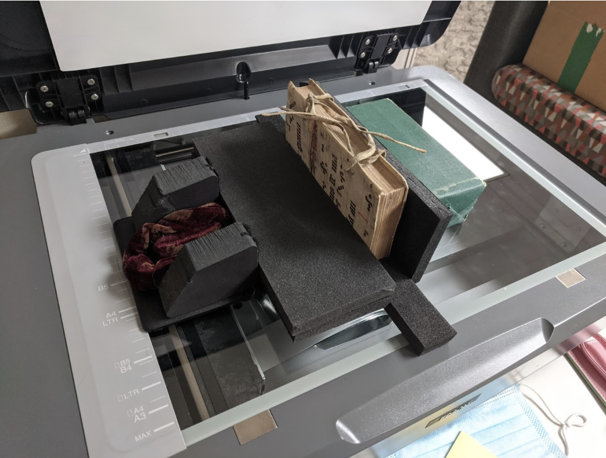
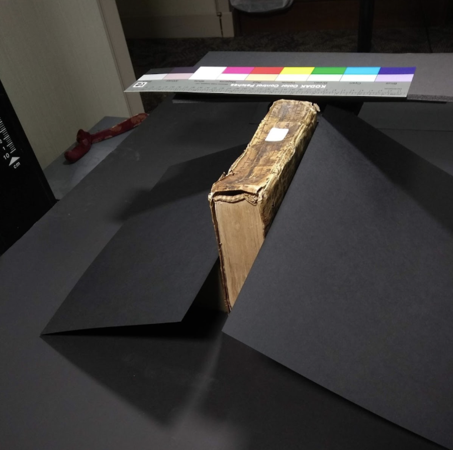
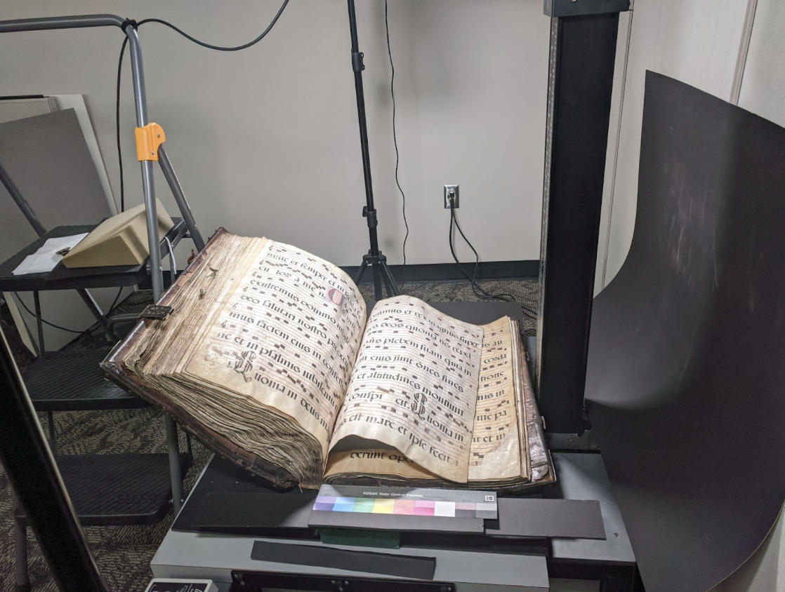
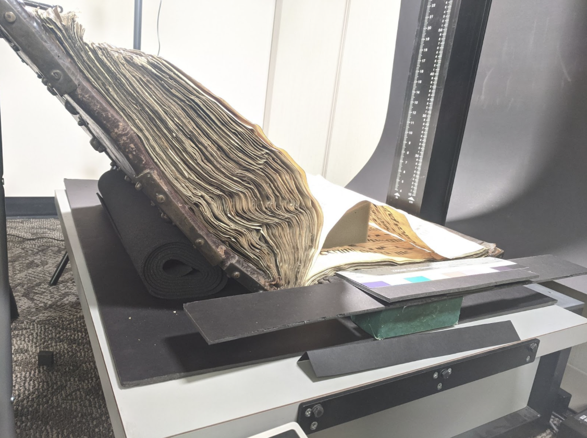
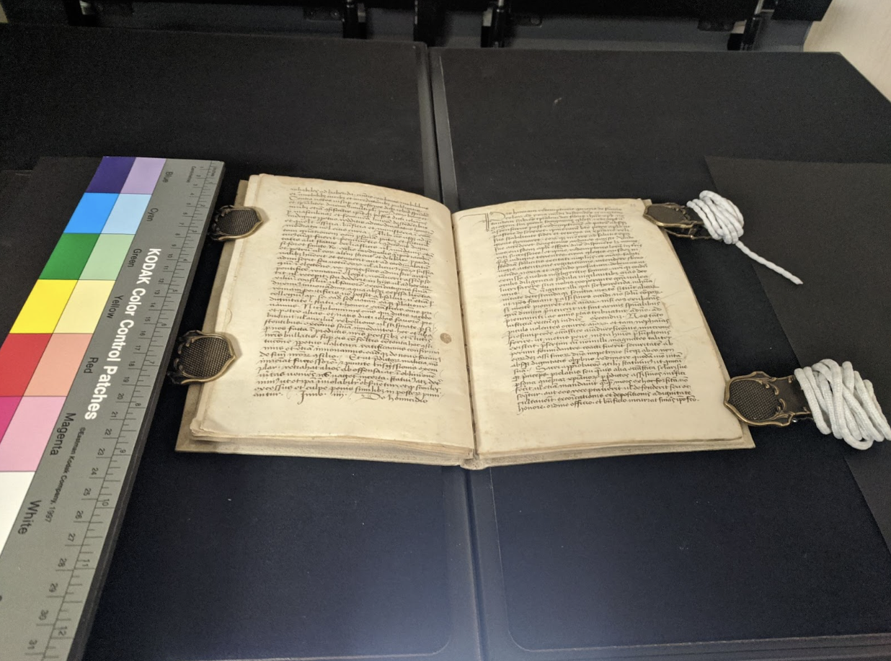
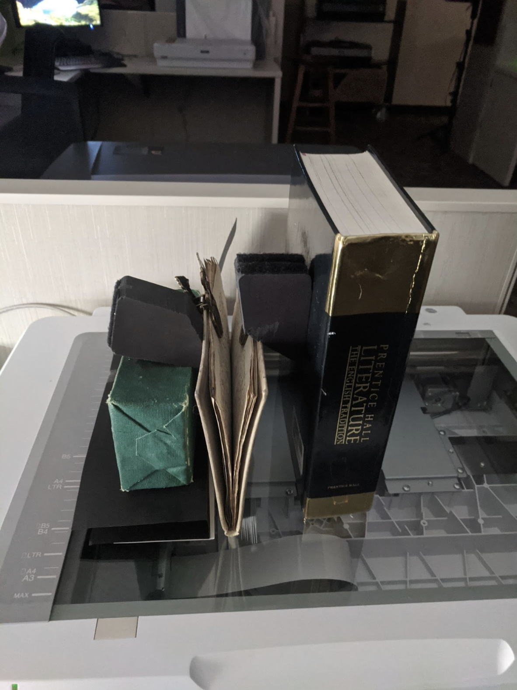

# Digitization Processing and Quality Control Procedures
## IUB & Partner Digitization Processing by Item Type for the Peripheral Manuscripts Project

## Overview 

Running documentation of materials and processes used for digitization based on the evaluated condition of each of the items received. Properties of the items will define hardware used to ensure no item damage and a quality image with minimal handling.

All digital items are captured at a minimum specification of 600dpi to ensure 4000px (or 400dpi at item natural size from the camera to avoid interpolation resolution by the nature of the item size), uncompressed TIFF, embedded color profile of AdobeRGB1998. If items with smaller detail are discovered, resolution will be increased to capture all detail present and meet the 4000pixel length on long side standard.  All captures will be adhering to the minimum [FADGI](http://www.digitizationguidelines.gov/guidelines/FADGI%20Federal%20%20Agencies%20Digital%20Guidelines%20Initiative-2016%20Final_rev1.pdf) 3 star guidelines to maintain standards. 

## Capture Guidelines by Item Type 

* Scale and color bar included if at all feasible. 
* Scan to individual page edges including small (¼ inch) borders. Exceptions will be noted such as items too large to accommodate both the item and any sundries. 
* Scan all pages, including blank pages
* If a bifolium, submit multiple images: 1) whole spread and 2) leaf-specific page images following cropping consideration outlined in the “Visual Quality Confirmation Checks” section of this document.  

### Book Bindings Only 

* Included capture of covering, internal attachment pages, edges, spine
    * If no handling concerns such as broken spines, detached areas, or item shedding, done on flatbed scanner. Used without lid, propped up so edge is flat to glass and is not weighed down by anything. Propped upright. See example below of capture process and resulting images. 
    * If there are handling concerns, must be done on overhead scanner or with a Camera, whichever will achieve best results given depth of the item and possible focus issues. Will be propped upright - may require additional materials to make scans look acceptable. Keep the color bar and ruler in the image, with the ruler remaining as stable as possible in relation to the item being imaged.
    * Sundries used: Foam blocks wrapped in acid free paper, brick wrapped in acid free paper, weights for support, paper masking for item surrounds, extended backing sheets, gentle clips for holding pages, foam wedges
* Orientation for book bindings: when scanning, orient bound volumes as one would flip through the book, i.e. do not rotate for legibility.

### Bound Volumes  

* Tightly Bound 
    * Must be done on overhead scanner in  V-mode. Cannot be done easily with camera.
    * Scale and colorbar need to be made level with the page being scanned, to ensure both the book and the scale are in focus. Held up on foam blocks if possible; does require experimentation to make sure both book and scale are in focus.
    * Held open using finger, spatula, clips, etc. Nothing can be obscuring the text on the page when holding the item open.
    * Sundries used: Foam blocks wrapped in acid free paper, brick wrapped in acid free paper, weights for support, paper masking for item surrounds extended backing sheets, museum style non-glare glass plate
* Loosely Bound
    * Small & Regular Sized Items
        * Must be done on overhead scanner if small enough to fit. Can use either V-mode or Flat Book mode if appropriate. 
        * Held open using finger, spatula, etc. Nothing can be obscuring the text on the page when holding the item open.
        * Scale and colorbar need to be made level with the page being scanned, to ensure both the book and the scale are in focus. Held up on foam blocks if possible; does require experimentation to make sure both book and scale are in focus.
        * Scan to individual page edges including small borders.
    * Oversized items
        * Must be done with Camera. 
        * Requires two people, so the process does not become cumbersome or take too long. One person runs camera and processing controls while the other handles materials. 
        * Team lift and moving of materials and repacking.
        * Held open using finger, spatula, etc. Nothing can be obscuring the text on the page when holding the item open.
        * No glass plates or weights over item
        * Scale and colorbar need to be made level with the page being scanned, to ensure both the book and the scale are in focus. Held up on foam blocks if possible; does require experimentation to make sure both book and scale are in focus and control shadows
    * Sundries used: Ladder. Foam blocks wrapped in acid free paper, brick wrapped in acid free paper, weights for support, paper masking for item surrounds extended backing sheets, sponge wedges, acid free boards for item support, glass plate, gentle clips
* Orientation for bound volumes: when scanning, orient bound volumes as one would flip through the book, i.e. do not rotate for legibility.

### Leaves 

* &lt; 12” x 17”
    * On flatbed scanner, backed by black matte paper
    * If gilded, may have to digitize using overhead scanner or Camera to eliminate shine and glare.
    * Depending on detail of item, if any require higher than 600 DPI, will have to be done on flatbed scanner or with Camera; unless overhead scanner captures above 600 DPI.
    * All items taken out of plastic or mylar sleeves if at all possible.
    * Sundries used: Foam blocks wrapped in acid free paper, brick wrapped in acid free paper, weights for support, paper masking for item surrounds. extended backing sheets, museum glass
* Oversize (for most flatbed scanners)
    * On copystand with Camera. Each item requires recalibration and repositioning of lights to eliminate shadow, glare, adjusting light intensity, color temperature, and diffusion. Exposure measured TTL, color temperature set in software matching LED light output, AdobeRGB1998 color profile embedded upon TIFF export of resolution at measured physical size of the item. 
    * On-lens circular polarizer filters for glare reduction where needed, esp. Framed items under glass.
    * Item size will define lens focal length selected for least lens aberration.
    * Item physical measurements required for proper image scale output.
    * Sundries used: Ladder. Foam blocks wrapped in acid free paper, brick wrapped in acid free paper, weights for support, paper masking for item surrounds, extended backing sheets, carrying boards to support the items, gentle clips.
    * May require multiple people for moving items, adjustments, capture, etc.
* Orientation for leaves: when scanning, orient items as one would handle them, i.e. do not flip for legibility, but flip right to left.

#### Housing for Items 

* If possible, take items out of their housing to scan.
    * Housing includes folders, mylar envelopes, etc.
    * If pages are attached to folders with tape or sealed in mylar envelopes, you can leave them housed, however it is preferable to take them out if possible. 
    * Take items out of frames to scan. Sometimes this is not possible, but it’s preferable to do so. If you cannot/are not permitted to take items out of their frames, capture the whole item including the frame (see details below).

#### Framed Items 

_Framed items are captured as-is to the best of our ability._

* On copystand with Camera. 
* Black backing board
* Both sides of item
* Glare from existing glass mitigated by use of circular polarizing filter
* Orientation for framed items: when scanning, orient items as one would handle them, i.e. do not flip for legibility, but flip right to left.

## Quality Confirmation Checks 

### Visual QC by Digitization Team 

An initial visual quality confirmation check is conducted for every capture. The Digitization Team ensures the best possible capture given the physical condition of the materials.  

* Items photographed or scanned on the flatbed (loose leaves, fragments, codex edges, etc.) are verified immediately post-capture.  
    * Digital images are compared to the original items for accuracy in representation including legibility, focus, color. Extra care is taken with gold leaf items to not cause glare.
    * Items are checked to make sure they are: 
        * not crooked
        * that all edges are included in the scan
        * that the DPI and file type are correct
        * Also checked to make sure the color bar and scale are represented correctly.
    * Naming scheme and save location are double checked.
* Items digitized with the overhead scanner (codices) are verified once capture of the whole codex is complete.
    * Images are cropped to reflect context 
    * As part of the cropping process, the digital images are compared to the original item for accuracy in representation including legibility, focus, pagination, color.
    *  Items are checked to make sure they are: 
        * not crooked
        * that all edges are included in the scan 
        * that the DPI and file type are correct
        * Also checked to make sure the color bar and scale are represented correctly.
* Once complete items pass QC, the Digitization Team will upload the TIFF images to a Google Folder or IU server (depending on the partner institution) for automatic QC and Project PIs to access for another round of quality review. 

## Automated Quality Confirmation Checks 

Once files complete visual QC by the Digitization Team, the TIFFs are uploaded to an IUB server set up for each institution for secure transfer or via Google Folder, depending on the Partner and quantity of items being delivered, for automatic quality checks.

As items are pushed to the IU Scholarly Data Archive (SDA) for long term storage and preservation, the files go through automated computer checks to ensure files are conformant and things are as expected.

The exact parameters are (with Goshen as the example here):

	group qc {
      		match(GROUP.NAME, "goc_###_###"); 
  	}	
    	qc {
        	id_format = "tiff";
        	id_compression = "none";
        	any(id_horizontal_resolution,400,600);
        	any(id_vertical_resolution,400,600);
        	any(id_profile_icc,432,408,551,544,560);
        	match(FILENAME,"goc_(###)_(###)-(#####).tif");
        	unique("filename",FILENAME);
    	}
   	process {
		copymaster(hpss_spool);
	}

This automated check ensures that all the files are well-formed TIFFs with the expected naming, resolution, compression, color embedding, and uniqueness so there is no accidental overwriting. Humans make errors, having automated checks in place help reduce errors before they are shuffled to long-term storage. This is especially useful for naming conventions and well formed files that are the most easily missed in visual checks.

A report is generated should files fail auto QC. The IUB team will share this report with the partnering teams to address the issues.  Corrected and updated files would be re-deposited to IUB for another round of auto QC until all conform before PIs commence with their visual QC. 

### Visual QC by Project PIs  

The Project PIs are subject experts and are leading the manuscript description process.  As part of this work, they may examine the digital surrogates differently than the Digitization Team. To make sure manuscripts are captured in ways that also support description work, the Project PIs will complete their own review of the digital surrogates.

* Once items pass auto QC, the IU Digitization Team will make the high resolution files available to the Project PIs for their visual QC
* PIs will review images as they are uploaded with a 1 week timeframe for final review.
* Should PIs flag issues, the Digitization Team has 5 days to review and rescan if necessary.   
* Rescans will need to be re-uploaded to the IU server or Google Folder for a final round of automatic quality checks before IU stores files in their Scholarly Data Archive. 

## Deliver Files to IUB (for External Digitization) 

### Partner Uploads Files to IU  

1. Server/Google Drive and access will be set at time of need. 
    1. Location path for upload per institution.
2. After items are digitized and visually checked by the scanning institution (section above) correctly named and foldered files are uploaded to the designated server address.
    2. The pattern for file naming is as follows: 

                **[institution code]_[item number]_[series number]-[image number]**

    3. [Look for your three letter institution code](https://docs.google.com/spreadsheets/d/1_McjMl3VEekWd6_m50fCdN3uZBWsYUXI/edit?usp=sharing&ouid=105375117015818951709&rtpof=true&sd=true) (restricted access)
    4. Item number is indicated by the order manuscripts are listed in your inventory, and is represented by 3 sequential digits starting with 001: 001, 002, 003, etc.
    5. We need a series number even if you only have one item. If so, use, 001. If you have more than more than one ‘part’ to your ‘item’, and is represented by 3 sequential digits starting with 001, 002, 003, etc. 
        3. If you don’t have a series, make sure to use 001. 
        4. For example, if there are two volumes of a book that you would like to have associated with one another, and they are listed first in the inventory, it would be 001-001 and 001-002 to indicate they are parts one and two of the first item
    6. Image number starts at 1, and is 5 digits: 00001, 00002, etc. This includes covers, edges, blank pages - everything is numbered sequentially. 
        5. Front cover will be the first image, then all inside pages, then back cover, spine, top edge, side edge, bottom edge.
    7. The complete naming scheme, then, would be something like: goc_001_001-00001.tif, goc_002_001-00001.tif, goc_002_001-00002.tif, etc.
3.  Along with the images, an excel manifest spreadsheet that tracks the technical metadata re: digitization should also be uploaded. 
    8. Server access and explicit instructions will be provided when needed. There will be a round to test items to smooth any workflow issues with particular institutions and technological needs.
4. When all images in an item or batch of items are complete and uploaded, email IU team to run automatic quality control checks. This will confirm all files are named and formed according to consistent requirements and all pages/images are present for each item.
    9. Errors will be communicated to the institution for correction and re-uploading. 
    10. Successful items will continue on to SDA and the partner server area for research and metadata creation.
5. Any issues from the PI investigations will go directly to the digitizing institution for correction/evaluation/re-upload and the process will repeat until all items are complete.

## Hardware Specifications 

### Partner Equipment 

#### Bowling Green 

* Epson Perfection V800
* Epson Expression 11000XL

#### Northern Illinois University 

* PhaseOne iXG 100MP 72mm
* Schneider 72mm lens
* DT Photon MKII

### IUB Equipment 

IU Hardware: All hardware meets or exceeds Best Practice capabilities of capture and poses no issue with standard archival compliance.

* **Epson Expression 11000XL, 12000XL and 13000XL**: use concern clarification: p53 “. However, FADGI recognizes that flatbed scanners have their place and may be appropriate for some applications.” p24”• Single exposure total area capture scanning systems are considered the most appropriate technologies when imaging special collections materials. However, FADGI permits the use of other technologies that may be appropriate as long as none of the stated restrictions are compromised by the use of that technology.”
* **Hasselblad H1/P45**: use concern clarification: p52 “the results are compelling and the cultural heritage community has embraced professional digital cameras. Given the complexity of these imaging systems, it is essential to test the entire imaging system for performance.”
* **Dracast LED500 Bi-color lighting:** selected to remove any temperature impact on the items when photographing in concert with the Hasselblad. P24 under Not Recommended “Lighting systems that raise the surface temperature of the original more than 4 degrees F (2 degrees C) in the total imaging process”
* **Bookeye 4a**: use concern clarification: p52 “Planetary scanners…. take time to capture an image and are only efficient for original materials that can be held flat during the long exposure cycle’ p24”• Single exposure total area capture scanning systems are considered the most appropriate technologies when imaging special collections materials. However, FADGI permits the use of other technologies that may be appropriate as long as none of the stated restrictions are compromised by the use of that technology.”
* **Nikon D850 DSLR Camera** [Lilly Production Lab]
* **Nikon AF-S NIKKOR 24-120mm f/4G ED VR Lens** [Lilly Production Lab]
* **ikan Lyra Half x 1 Bi-Color 2-Point Soft Panel LED Lights** [Lilly Production Lab]

Guidelines applied and considered for each material type along with the capabilities of the hardware and software available:

FADGI p56 “Digitization: The actual digitization process will vary dramatically based on the type of materials being digitized and the scale of the effort. FADGI does not provide recommendations on the specific design of digitization projects.”

Equipment Selection:

“Selection of Digitization Equipment: Proper selection of digitization equipment is an essential element of a successful digitization program. Factors to consider are: 

    • Type of materials to be digitized 
    • Size of the originals
    • Quantity of each type of original 
    • Condition of the materials and how they can be handled during scanning 
    • Staff digitization experience and quantity 
    • Budget 
    • Physical space available 
    • Duration of the project

*FADGI p. 19 Addressing use choice concerns “Special collections materials should not be placed in contact with glass or other materials in an effort to hold originals flat while imaging without the approval of a paper or book conservator. This technique can lead to physical damage to the original. Spatulas or other implements to assist in holding pages flat for imaging may be used, but must not obscure informational content. If used, these should not be edited out of master files.“

## Examples of Capture Featuring Propping Techniques

Using foam pieces and weights wrapped in archival tape to prop up a codex to scan the edges on an Epson flatbed scanner.

Using foam pieces and weights wrapped in archival tape to prop up a codex to scan the edges on the Bookeye overhead scanner.

Using foam, ladder, and rolled up yoga mat to prop up a large codex, to make the edges lay flat and protect the spine from bending too much, with the camera.

Codex on Bookeye overhead scanner being held open with clips - clips on right side assisted with weighted rope.

Another example of propping for codex edge scanning, utilizing foam, a weight wrapped in archival tape, and a heavy textbook.

